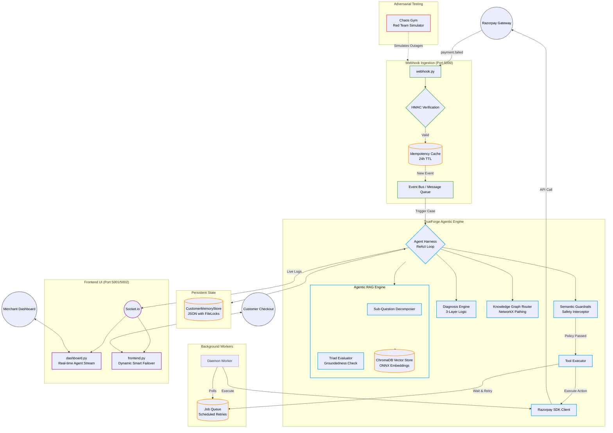

# AutoRecover — Razorpay AI Revenue Recovery Agent & OpenCode Operations HUD

An autonomous AI agent that detects failed payments, diagnoses root causes via pure LLM diagnostic reflection, and executes bounded recovery workflows using official Razorpay APIs. Built for the Razorpay Buildathon with LangGraph, Nemotron LLM, NVIDIA NAT Guardrails, and an OpenCode-inspired Developer Operations HUD.

---

## 🎯 How It Works

```
Payment Fails → Webhook Sensing → LLM Diagnostic Reflection → Tier Assignment → Decline-Code Routing → Guardrail Check → Knowledge Graph Routing → Razorpay SDK Tool Execution → Generative UI Morphing
```

### System Architecture



### Two-Tier Recovery (Industry-Grade)

```
Payment fails
  ├─ TIER 1: SILENT RECOVERY (Background — no customer contact)
  │   ├─ Analyze decline code + 40+ signals
  │   ├─ Schedule retry at optimal window (payday timing, bank health)
  │   ├─ Customer stays active, unaware of failure
  │   └─ Multiple silent retries before escalation
  │
  └─ TIER 2: ACTIVE RECOVERY (Customer-facing — only if Tier 1 exhausted)
      ├─ Personalized email/SMS/WhatsApp
      ├─ Links to payment update page
      └─ Copy adapts to specific decline reason
```

### Stopping Conditions
- **Recovered** — Payment retried, payment link completed, or card expiry updated via Razorpay API.
- **Escalated** — Handed off to human support when attempts or risk thresholds are reached.
- **Max Attempts** — Agent stops after bounded attempts (separate limits for silent and active tiers).
- **Abandoned** — Stopped when customer opts out or no viable recovery path exists.

---

## 🔬 Official Razorpay Knowledge Base & Failure Normalizer

The system embeds an official Razorpay API Error Knowledge Base (`src/recovery_agent/razorpay_knowledge_base.py`) built directly from Razorpay's official API Error documentation:

- **Error Codes Catalog**: `BAD_REQUEST_PAYMENT_TEMPORARY_TECHNICAL_ISSUE`, `BAD_REQUEST_CARD_EXPIRED`, `BAD_REQUEST_PAYMENT_INSUFFICIENT_FUNDS`, `BAD_REQUEST_PAYMENT_DECLINED_BY_BANK`, `BAD_REQUEST_MANDATE_INACTIVE`, `BAD_REQUEST_CHECKOUT_ABANDONED`, `BAD_REQUEST_RISK_CHECK_FAILED`.
- **Error Taxonomy**:
  - `source`: `customer`, `business`, `gateway`, `razorpay`.
  - `step`: `payment_initiation`, `payment_authentication`, `payment_authorization`, `payment_capture`.
- **Payload Normalization**: Automatically normalizes customer-facing UI messages (e.g. *"Your payment could not be completed due to a temporary technical issue. To complete the payment, use another payment instrument."*) into full Razorpay API Failure Payloads.

---

## 🖥️ OpenCode Developer IDE Interface & Operations HUD

The Merchant Dashboard ([http://localhost:5002/merchant](http://localhost:5002/merchant)) is designed as an **OpenCode-inspired technical IDE**:

- **Monospace Typography**: `JetBrains Mono` and `Fira Code`.
- **Dark IDE Palette**: Crisp `#0d1117` background with `#30363d` 1px borders and clean status trace badges (`[DETECT]`, `[DIAGNOSE]`, `[GUARDRAIL]`, `[ACTION]`, `[SUCCESS]`).
- **Fixed Monologue Viewing Window**: Strictly bounded `380px` height (`min-height: 380px`, `max-height: 380px`) with auto-scrolling terminal logs.
- **Tool Execution Code Cards**: Displays real Razorpay SDK API JSON response objects (`RazorpaySDK.Order.create`, `RazorpaySDK.Payment.capture`).
- **Claude-Style Dual View Switcher**:
  - `[ Canvas View ]`: Dynamic Generative UI morphing cards (WhatsApp link, Card Expiry form, Hinglish Voice AI Call, 5-step progress pipeline).
  - `[ Store Checkout (/pay) ]`: Embedded live browser iframe pointing to `http://localhost:5002/pay` for testing real checkout payment flows inside the split-screen HUD.

---

## 🛠️ Setup & Usage

### Prerequisites
- Python 3.12+
- Razorpay test account ([Razorpay API Keys](https://dashboard.razorpay.com/app/keys))

### Install & Configure

```bash
git clone https://github.com/suraj-0628/Razorpay-AI-Revenue-Recovery-Agent.git
cd Razorpay-AI-Revenue-Recovery-Agent
python -m venv .venv
source .venv/bin/activate
pip install -e .
cp .env.example .env
```

### Start Services

```bash
./start.sh
```

Serves:
- **Merchant Operations HUD**: [http://localhost:5002/merchant](http://localhost:5002/merchant)
- **Customer Store Checkout**: [http://localhost:5002/pay](http://localhost:5002/pay)
- **Recovery Analytics Dashboard**: [http://localhost:5001](http://localhost:5001)
- **LangGraph Agent Flow Graph**: [http://localhost:5001/graph](http://localhost:5001/graph)
- **Razorpay Webhook Listener**: [http://localhost:5000/webhook](http://localhost:5000/webhook)

---

## 🧪 Verification & Test Suite

```bash
.venv/bin/pytest tests/ -v
```

- **Unit Test Suite**: `209 PASSED` (100% pass rate).
- **Adversarial Chaos Gym**: `31 PASSED` in `10.50s`.

---

## 📁 Architecture Breakdown

```
src/recovery_agent/
├── agent/
│   ├── __init__.py              # LangGraph agent loop (detect → diagnose → decide → act → observe)
│   ├── diagnosis.py             # LLM diagnostic reflection chain
│   ├── decision.py              # LLM Strategy Planner & Guardrail intercept
│   ├── execution.py             # Razorpay SDK action execution
│   ├── guardrails.py            # NVIDIA NAT Guardrails (5 policies)
│   ├── kg_router.py             # Razorpay Knowledge Graph router (6 API rails)
│   ├── memory.py                # Customer long-term memory store & payday radar
│   ├── llm_client.py            # Shared LLM client (Nemotron via OmniRoute)
│   ├── squad.py                 # Multi-agent squad orchestrator (4 specialized agents)
│   ├── decline_router.py        # [PLANNED] Decline-code-specific routing
│   ├── payday_scheduler.py      # [PLANNED] Regional payroll cycle detection
│   └── signals.py               # [PLANNED] 40+ signal enrichment
├── eval/
│   ├── chaos_gym.py             # Adversarial chaos gym & red-team simulator
│   └── trajectory_benchmark.py  # Step/friction/compliance scoring
├── razorpay_knowledge_base.py   # Official Razorpay API Error Catalog & Normalizer
├── razorpay_client.py           # Razorpay SDK API wrapper
├── frontend.py                  # Merchant Operations HUD & Customer Checkout
├── webhook.py                   # Razorpay Webhook Listener
├── dashboard.py                 # Recovery Analytics Dashboard
├── communication.py             # LLM-generated recovery messages
├── retry_scheduler.py           # Smart retry timing
├── logging.py                   # JSONL audit logging
└── templates/
    └── index.html               # OpenCode-inspired Developer Operations HUD
```

---

## 🏭 Industry-Grade Improvements (In Progress)

Based on deep-dive research on 6 production recovery systems — **Stripe, Redux, Recurly, Churnkey, Slicker, and Razorpay Agent Studio**. See `INDUSTRY-RESEARCH.md` for full technical details.

### Phase 1: Silent Recovery + Decline-Code Routing

**Two-Tier Recovery Architecture** (inspired by Redux "Silent First"):
- **Tier 1 (Silent)**: Background retries with NO customer contact. Customer stays active, unaware of failure. Eliminates churn trigger from unnecessary payment failure emails.
- **Tier 2 (Active)**: Only triggered when silent tier exhausted. Customer receives personalized email/SMS with payment update link.

**Decline-Code-Specific Routing** (inspired by Redux per-code strategies):
- Code 51 (Insufficient Funds): Payday timing — retry at 12:01 AM local time on payday, "first-in-line advantage" before other subscriptions clear.
- Code 05 (Do Not Honor): Metadata enrichment — optimize transaction "shape" to look trustworthy, cooling-off period.
- Code 19 (Try Again Later): Bank health monitoring — retry only when bank confirmed online.
- Hard Declines (41, 43, 54, 14, 04, 46, 57, 93): Never retry — prevents $0.10/attempt Visa/MC network penalties.

**Expected impact**: +15-25% recovery rate, -40-60% customer contact rate

### Phase 2: Signal Enrichment (40+ Features)

Expanded from ~15 to 40+ signals (inspired by Stripe 500+, Redux 100+, Slicker 40+):
- Card brand, type, issuing bank, BIN
- Customer timezone, bank health score, velocity patterns
- Merchant descriptor, MCC code, transaction amount vs norms
- Payday detection, holiday awareness

### Recovery Rate Targets

| Phase | Target | Industry Benchmark |
|-------|--------|-------------------|
| Current | 40% | — |
| Phase 1 | 55-65% | Redux 40-50%, Stripe 55% |
| Phase 2 | 65-75% | Recurly 70%, Slicker 70-85% |

See `IMPLEMENTATION-PLAN.md` for full roadmap and `IMPROVEMENTS-TRACKER.md` for change log.

---

## 📄 License

Razorpay Buildathon 2026 — AI Revenue Recovery Track
