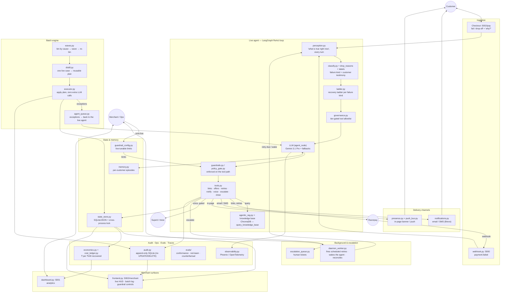

# AutoRecover — AI Revenue Recovery Agent

An autonomous agent that turns **failed payments back into revenue**. When a payment fails, AutoRecover figures out *why* it failed, works the case the way a good operations person would — a different payment rail, a timed retry, a discount only when price is genuinely the problem — and stops when the money is in or a human is genuinely needed. It works one live payment in real time, and the **same agent** works a whole backlog in batches.

Built for the **Razorpay AI Buildathon** — *AI Revenue Recovery* track.

> **The track asks for:** *measured money recovered across a batch, with compliant escalation, stopping rules, and an audit trail.* AutoRecover has all five, and this README points at where each one lives.

| The ask | Where it lives |
|---|---|
| **Measured money** | Gateway-verified capture per case, priced in ₹ — `economics.py`, the **Ops** view |
| **Across a batch** | Re-binning **waves** over the whole backlog — `batch/waves.py`, the **Batch** view |
| **Compliant escalation** | The agent *cannot* escalate until the ladder is exhausted — `agent/ladder.py`, `escalation_queue.py` |
| **Stopping rules** | Every case ends recovered, escalated, or waiting on a retry — `agent/tools.py` (`close_case`, `wait_for_customer`), `agent/stopping.py` |
| **Audit trail** | Append-only SQLite that refuses `UPDATE`/`DELETE` — `audit.py`, the **Batch engine** log |

---

## Quickstart

**Prerequisites:** Python 3.11+ (3.12 recommended), and an OpenAI-compatible LLM endpoint.

```bash
# 1. install (creates .venv and installs the package)
make setup            # or: python -m venv .venv && source .venv/bin/activate && pip install -e .

# 2. configure — copy the example and fill in your keys
cp .env.example .env  # REQUIRED: Razorpay test keys + an LLM endpoint. Rest is optional.

# 3. run everything
make start            # or: ./start.sh
```

`start.sh` launches five processes and prints their health:

| Service | Port | What it is |
|---|---|---|
| **Frontend** | `5002` | Customer checkout (`/pay`) + Merchant HUD (`/merchant`) |
| **Dashboard** | `5001` | Analytics / metrics |
| **Webhook** | `5000` | Razorpay `payment.failed` listener (`/webhook`) |
| **Phoenix** | `6006` | Live tracing (Arize Phoenix) |
| **Daemon** | — | Scheduled retries, batch settle, cost reconciliation |

Open the **checkout** at `http://localhost:5002/pay`, fail a payment, and watch the agent work it live in the **Merchant HUD** at `http://localhost:5002/merchant`.

**Minimum to run:** just two things — Razorpay **test** keys, and **any OpenAI‑compatible LLM** (endpoint + model + key). Everything else — SuperU voice, Brevo email, Phoenix tracing — is **optional and off by default**; the stack boots and demos without them (e.g. with no email keys, messages are written to `data/outbox/` instead of sent). `.env.example` marks exactly what's required vs optional.

The LLM is configured entirely by env vars, so any OpenAI‑compatible provider works — point it at your own key:

```dotenv
LLM_BASE_URL=https://api.openai.com/v1   # or Gemini / Groq / Together / a local router
LLM_MODEL=gpt-4o                          # a capable reasoning model is recommended
LLM_API_KEY=sk-your-key-here
```

---

## What it does

A single recovery, end to end:

1. **A payment fails** — via a Razorpay `payment.failed` webhook, or the customer failing/abandoning the checkout.
2. **If the customer is still on the page**, it asks them one question — *"why did you stop?"* — because their own answer beats any guess from an error code.
3. **The agent diagnoses the cause** and picks the plan that fits it: a bank decline needs a different rail at full price, an empty account needs a timed retry, a price objection is the one case a discount answers.
4. **It acts** — creates a payment link on a working rail, shows it in-page and/or emails it, or schedules a quiet retry — then **waits**, without nagging.
5. **When the money lands** (confirmed by the gateway) it **closes the case**; if it truly runs out of options, it **escalates to a human** — but only then.

The same machinery runs over a **backlog in batches** (see *Batch engine* below).

---

## Architecture

The core idea: **the intelligence is the scaffolding around the model, not a bigger prompt.** The model decides *what* to do; the structure around it decides what it's *allowed* to do, remembers what's true, and guarantees the case reaches a clean ending.



### Layers

- **Ingestion** — `webhook.py` handles the Razorpay `payment.failed` event; the checkout page posts failures and drop-offs (with the customer's stated reason) to the frontend.
- **The live agent** — a LangGraph ReAct loop (`agent/graph.py`). Each turn: `perception` rebuilds the ground truth from the durable record, `classify` decides the failure kind, `ladder` says which steps are allowed for that kind, `governance` binds only the permitted tools, the model chooses, and every tool call clears the **guardrail gate** before it runs.
- **The batch engine** — the *same* agent at scale (`batch/`). Cases are binned by cause; the live agent works one representative case per bin, its decision is distilled into a plan and replayed across the look-alikes with **zero extra LLM calls**, and anything that doesn't fit is handed back to the live agent.
- **State & memory** — `state_store.py` is the durable, cross-process case store; `memory.py` keeps per-customer recovery history; `presence.py` + `push_bus.py` deliver in-page notifications only when the customer is actually on the page.
- **Trust surfaces** — an append-only audit log, unit economics, an eval suite, and full tracing (below).

---

## Key mechanisms

### The Recovery Ladder — policy per failure kind
`agent/ladder.py`. There is no single script. Each failure kind climbs its own ordered steps, and the agent can't skip to the end:

| Failure kind | Ladder (in order) |
|---|---|
| **method** (bank/instrument decline) | page push → **rail switch (full price)** → offer → voice call → alternate path |
| **funds** (empty account) | **timed retry** → page push → offer → alternate path |
| **transient** (gateway/network) | timed retry → page push → alternate path *(no discount — never pay a customer for our outage)* |
| **dropoff** (chose not to pay) | page push → **offer** → voice call → post-call email → alternate path |

`escalate_to_human` and `close_case(unrecoverable)` are *refused* until the ladder is genuinely exhausted — compliant escalation, enforced in code.

### The customer's own reason outranks the guess
`drop_reasons.py`. Two customers who abandon after a decline look identical to an error code but need opposite responses. So the checkout asks one question — *transaction kept failing / found it cheaper / didn't have the money* — and that testimony re-routes the ladder.

### Guardrails you can move in real time
`guardrails.py`, `policy_gate.py`, `guardrail_config.py`. The guardrail engine sits **between the agent and its tools** and returns a hard `blocked` with a reason — not advice the model can talk itself out of. Every limit (contact caps, discount ceiling, quiet hours, whether voice is on) is a **live control** in the Merchant HUD's Guardrail view; changing one takes effect on the agent's next decision. Opt-out is locked — it's a legal rule, not a setting.

### Multi-channel recovery — the pushiest channel is the most gated
- **In-page** — `show_page_offer` / `send_page_push`, delivered only to a live checkout.
- **Email / SMS** — `notifications.py` (email via Brevo SMTP; SMS is file-only), metered against a daily budget (`email_quota.py`).
- **Voice** — `initiate_voice_call` places a real call via **SuperU** — but only above an order-value threshold, never in quiet hours, and only after cheaper steps have had their chance. Call cost is reconciled against SuperU's own bill (`cost_ledger.py`), not estimated.

### Append-only audit trail
`audit.py` is a SQLite table whose `UPDATE`/`DELETE` are refused by triggers. The Merchant HUD's **Batch engine** view is a straight read of it — every line on screen is a row that can't be quietly rewritten.

### Unit economics
`economics.py` accumulates real token/message/call cost per case and reports **cost per ₹100 recovered**, splitting live cases from seeded test ones so the number is honest.

### Evals — proof it behaves, not just a demo that worked
`evals/`. Every decision is logged and scored against policy (**conformance**); a **red-team** suite tries to trick the agent into a bad discount or a premature escalation; a **counterfactual** compares the agent's discount discipline against a naïve "discount everyone" baseline; scores are frozen as a **baseline** so a regression fails before it ships.

```bash
make evals          # run the suite, write EVALS.md + a scorecard
make ci             # tests + a recorded-decision regression check
```

### Observability
`observability.py` — one shared Arize Phoenix / OpenTelemetry init. Every span is stamped with `session.id = case:{payment_id}`, so a **Phoenix session is a recovery case**: one click shows every model call, tool, and guardrail it took, with a running token and ₹ cost. Spans are typed (AGENT / CHAIN / LLM / TOOL / GUARDRAIL), so a trace reads like the architecture.

---

## Repository layout

```
src/recovery_agent/
├── agent/                 # the live agent
│   ├── graph.py           #   LangGraph ReAct loop + model routing
│   ├── perception.py      #   "what is true right now" every turn
│   ├── classify.py        #   failure kind (+ operator/customer testimony)
│   ├── ladder.py          #   recovery ladder per failure kind
│   ├── governance.py      #   tier-gated tool allowlist
│   ├── tools.py           #   the recovery tools (links, offers, retries, voice, close)
│   ├── guardrails.py      #   the guardrail engine
│   ├── policy_gate.py     #   guardrails enforced on the tool path
│   ├── llm_client.py      #   LLM access + capability-ordered fallback
│   ├── agentic_rag.py     #   RAG over the recovery knowledge base (ChromaDB)
│   ├── memory.py          #   per-customer recovery history
│   └── offers.py, diagnosis.py, decision_log.py, stopping.py
├── batch/                 # the same agent, at scale
│   ├── waves.py           #   bin → wave → re-bin
│   ├── distill.py         #   one live case → reusable plan
│   ├── executor.py        #   apply the plan, zero extra LLM calls
│   ├── agent_queue.py     #   exceptions → back to the live agent
│   └── planner.py, plan.py, tiers.py, run.py
├── evals/                 # conformance, redteam, counterfactual, replay, quality
├── frontend.py            # Flask + Socket.IO: checkout + Merchant HUD (:5002)
├── dashboard.py           # analytics (:5001)
├── webhook.py             # payment.failed listener (:5000)
├── daemon_worker.py       # scheduled retries, park-on-boot, reconciliation
├── state_store.py         # durable, cross-process case store
├── audit.py               # append-only audit log (SQLite)
├── economics.py           # unit economics (₹ per ₹100 recovered)
├── cost_ledger.py         # BILLED / MEASURED / ESTIMATED cost provenance
├── guardrail_config.py    # live-tunable guardrail policy
├── drop_reasons.py        # the "why did you stop?" flow
├── notifications.py       # email (Brevo) / SMS dispatch
├── observability.py       # Phoenix / OpenTelemetry tracing
└── presence.py, push_bus.py, escalation_queue.py, email_quota.py,
    labels.py, ratelimit.py, razorpay_client.py, razorpay_knowledge_base.py
```

---

## Tech stack

- **Agent** — [LangGraph](https://github.com/langchain-ai/langgraph) ReAct loop, OpenAI-compatible LLM (Gemini 3.1 Pro via a local router), [langmem](https://github.com/langchain-ai/langmem) for durable memory.
- **RAG** — ChromaDB with a local ONNX embedding model (downloaded on first `start.sh`).
- **Payments** — the Razorpay Python SDK (test mode).
- **Channels** — Brevo SMTP (email), SuperU (AI voice).
- **Web** — Flask + Socket.IO; a single-page Merchant HUD and checkout.
- **State** — SQLite + JSON with cross-process file locks.
- **Observability** — Arize Phoenix over OpenTelemetry (OpenInference).

---

## Testing

```bash
.venv/bin/pytest tests/      # the full suite (1000+ tests, ~35s)
make ci                      # tests + recorded-decision regression gate
make evals                   # the eval suite → EVALS.md + scorecard
```

---

## Notes & limits

- **Razorpay is in test mode.** Payment links draw from a small per-account lifetime quota — the code tracks and protects it (`RAZORPAY_LINKS_ALREADY_SPENT`).
- **Voice calls cost real credits** and are **off by default** (`VOICE_CALLS_ENABLED=0`). Turn them on in the Guardrail view for a demo.
- **Email** needs a Brevo API key/verified sender; without one, sends are written to `data/outbox/` so the flow still runs.
- The agent never contacts a customer who has opted out, and never charges a payment that already succeeded.
