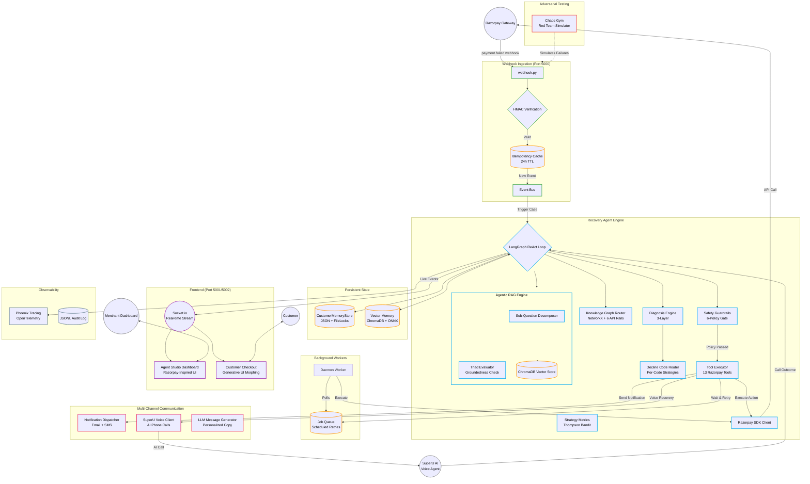

# AutoRecover — Razorpay AI Revenue Recovery Agent

An autonomous AI agent that detects failed payments, diagnoses root causes via LLM reflection, and executes multi-channel recovery workflows — email, SMS, and AI voice calls via SuperU — using Razorpay APIs. Built for the Razorpay Buildathon with LangGraph, Gemini 2.5 Flash, custom safety guardrails, and a Razorpay Agent Studio-inspired Merchant Dashboard.

---

## 🎯 How It Works

```
Payment Fails → Webhook Sensing → LLM Diagnostic Reflection → Tier Assignment → Decline-Code Routing
  → Guardrail Check → Knowledge Graph Routing → Channel Selection (Email / SMS / SuperU Voice Call)
  → Razorpay SDK Tool Execution → Outcome Observation → Generative UI Morphing
```

### System Architecture



### Three-Tier Recovery (Industry-Grade)

```
Payment fails
  ├─ TIER 1: SILENT RECOVERY (Background — no customer contact)
  │   ├─ Analyze decline code + 40+ signals
  │   ├─ Schedule retry at optimal window (payday timing, bank health)
  │   ├─ Customer stays active, unaware of failure
  │   └─ Multiple silent retries before escalation
  │
  ├─ TIER 2: ACTIVE RECOVERY (Customer-facing — if Tier 1 exhausted)
  │   ├─ Personalized email/SMS via LLM-generated messaging
  │   ├─ Razorpay Payment Links for one-click recovery
  │   └─ Copy adapts to specific decline reason + customer persona
  │
  └─ TIER 3: VOICE RECOVERY (AI Phone Call — high-value or unresponsive)
      ├─ SuperU AI voice agent calls the customer directly
      ├─ Natural conversation: identifies objection, offers alternatives
      ├─ Sends Razorpay Payment Link during the call
      └─ Customer can complete payment while on the phone
```

> **Why Voice?** Industry data shows email-only recovery converts 3-8%, email+SMS converts 8-15%, but adding AI voice calls pushes recovery to **25-40%**. This is the same stack Razorpay uses in production with SuperU.

### Stopping Conditions
- **Recovered** — Payment retried, payment link completed, or card expiry updated via Razorpay API.
- **Escalated** — Handed off to human support when attempts or risk thresholds are reached.
- **Max Attempts** — Agent stops after bounded attempts (separate limits for silent and active tiers).
- **Abandoned** — Stopped when customer opts out or no viable recovery path exists.

---

## 🔬 Official Razorpay Knowledge Base & Failure Normalizer

The system embeds an official Razorpay API Error Knowledge Base (`src/recovery_agent/razorpay_knowledge_base.py`) built directly from Razorpay's official API Error documentation:

- **Error Codes Catalog**: `BAD_REQUEST_PAYMENT_TEMPORARY_TECHNICAL_ISSUE`, `BAD_REQUEST_CARD_EXPIRED`, `BAD_REQUEST_PAYMENT_INSUFFICIENT_FUNDS`, `BAD_REQUEST_PAYMENT_DECLINED_BY_BANK`, `BAD_REQUEST_MANDATE_INACTIVE`, `BAD_REQUEST_CHECKOUT_ABANDONED`, `BAD_REQUEST_RISK_CHECK_FAILED`.
- **Error Taxonomy**:
  - `source`: `customer`, `business`, `gateway`, `razorpay`.
  - `step`: `payment_initiation`, `payment_authentication`, `payment_authorization`, `payment_capture`.
- **Payload Normalization**: Automatically normalizes customer-facing UI messages (e.g. *"Your payment could not be completed due to a temporary technical issue. To complete the payment, use another payment instrument."*) into full Razorpay API Failure Payloads.

---

## 🖥️ Razorpay Agent Studio-Inspired Dashboard

The Merchant Dashboard ([http://localhost:5002/merchant](http://localhost:5002/merchant)) is modeled directly after [Razorpay's Agent Studio](https://razorpay.com/agent-studio/):

- **Dark Top Navigation Bar**: Razorpay-style navbar with product links (Ray AI, Payments, Banking+, Payroll), search, and avatar.
- **Left Sidebar**: Full sidebar with sections — Main, Payment Products, Banking Products, Account & Settings. Agent Studio highlighted with `Beta` badge.
- **Agent Hero Card**: Agent identity (avatar + name), health indicator with pulsing green dot, Disable/Open Store action buttons.
- **Activity/Settings Tabs**: Clean tab bar with underline-style active indicator.
- **Scenario Triggers**: One-click buttons to simulate failures — 504 Degradation, Cart Abandonment, Expired Card, Bank Decline, Voice Call, and a 30-case batch runner.
- **Inline Metrics Bar**: 4 key metrics — Total, Recovered, Failed, Recovery Rate.
- **Activity Feed**: Real-time timeline with colored status dots (blue = processing, green = recovered, red = failed), relative timestamps, and "Live" indicators for active recoveries.
- **Case Detail Drawer**: Slide-out panel with payment info, status/tier badges, decline strategy, and full agent reasoning trail with color-coded step borders.

---

## 🛠️ Setup & Usage

### Prerequisites
- Python 3.12+
- Razorpay test account ([Razorpay API Keys](https://dashboard.razorpay.com/app/keys))

### Install & Configure

```bash
git clone https://github.com/suraj-0628/Razorpay-AI-Revenue-Recovery-Agent.git
cd Razorpay-AI-Revenue-Recovery-Agent
python -m venv .venv
source .venv/bin/activate
pip install -e .
cp .env.example .env
```

### Start Services

```bash
./start.sh
```

Serves:
- **Merchant Operations HUD**: [http://localhost:5002/merchant](http://localhost:5002/merchant)
- **Customer Store Checkout**: [http://localhost:5002/pay](http://localhost:5002/pay)
- **Recovery Analytics Dashboard**: [http://localhost:5001](http://localhost:5001)
- **LangGraph Agent Flow Graph**: [http://localhost:5001/graph](http://localhost:5001/graph)
- **Razorpay Webhook Listener**: [http://localhost:5000/webhook](http://localhost:5000/webhook)

---

## 🧪 Verification & Test Suite

```bash
.venv/bin/pytest tests/ -v
```

- **Unit Test Suite**: ~397 tests passing.

---

## 📁 Architecture Breakdown

```
src/recovery_agent/
├── agent/
│   ├── __init__.py              # RecoveryAgent wrapper
│   ├── graph.py                 # LangGraph ReAct loop (StateGraph + ToolNode)
│   ├── tools.py                 # 13 @tool functions + langmem memory tools
│   ├── diagnosis.py             # 3-layer: error code lookup → LLM → rules
│   ├── guardrails.py            # 6 safety policies
│   ├── governance.py            # Tier-based tool access, PII masking
│   ├── kg_router.py             # NetworkX graph, 6 API rails, Dijkstra
│   ├── memory.py                # CustomerMemoryStore (JSON + filelock)
│   ├── agentic_rag.py           # ChromaDB + sentence-transformers
│   ├── planner.py               # pydantic-ai structured planning
│   ├── llm_client.py            # ChatOpenAI → OmniRoute, fallback chain
│   ├── stopping.py              # Tier transition logic (silent → active)
```

---

## 🏭 Industry-Grade Architecture

Based on deep-dive research on 6 production recovery systems — **Stripe, Redux, Recurly, Churnkey, Slicker, and Razorpay Agent Studio**.

### Implemented: Three-Tier Recovery + Decline-Code Routing

**Three-Tier Recovery Architecture** (inspired by Redux "Silent First" + Razorpay Agent Studio voice channels):
- **Tier 1 (Silent)**: Background retries with NO customer contact. Customer stays active, unaware of failure.
- **Tier 2 (Active)**: Personalized email/SMS with Razorpay Payment Links. Only triggered when silent tier exhausted.
- **Tier 3 (Voice)**: SuperU AI voice agent calls the customer. Highest-conversion channel for high-value or unresponsive cases.

- Code 51 (Insufficient Funds): Payday timing — retry at 12:01 AM local time on payday, "first-in-line advantage".
- Code 05 (Do Not Honor): Metadata enrichment — optimize transaction shape, cooling-off period.
- Code 19 (Try Again Later): Bank health monitoring — retry only when bank confirmed online.
- Hard Declines (41, 43, 54, 14, 04, 46, 57, 93): Never retry — prevents $0.10/attempt Visa/MC network penalties.

### Decline-Code Routing

| Component | Role |
|-----------|------|
| `SuperUClient` | Wraps SuperU API — initiates outbound AI voice calls |
| `webhook.py` | Receives `/superu/call-complete` callback with call outcome |
| Dashboard | Shows voice call status in activity feed + drawer trail |

### Recovery Rate Targets

| Channel Mix | Target | Industry Benchmark |
|-------------|--------|-------------------|
| Email only | 3-8% | — |
| Email + SMS | 8-15% | Redux 40-50% (with silent retry) |
| Email + SMS + Silent Retry | 40-55% | Stripe 55%, Recurly 70% |
| **+ SuperU Voice Calls** | **55-75%** | Razorpay Agent Studio production |

---

## The Engineering Around the Agent — Governance, Economics, Memory, Evals

An agent is only as trustworthy as the machinery that watches it. Four systems surround the loop:

**1. Policy gate — guardrails ON the tool path.** Every customer-contact or money-moving tool call passes through the `GuardrailEngine` (quiet hours, frequency cap, opt-out, double-debit lock, monetary cap, hard-decline protection) at a dedicated LangGraph node *before* execution. A refusal is not a silent veto: it returns to the model as a ToolMessage with the reason and a workable alternative, lands on the case record's `refusals`, and shows up in the next turn's perception briefing — the agent *learns from policy* instead of bouncing off a cage. Every evaluation is appended to `audit_logs/guardrail_verdicts.jsonl` with the agent version, so "which policy refused this contact?" always has an answer.

**2a. Billed costs, not just estimated ones.** Every cost carries a **provenance**: `BILLED` (the provider's own invoice line), `MEASURED` (we counted the real quantity, priced at a configured rate) or `ESTIMATED`. Voice is billed: `reconcile_voice_costs` reads SuperU's call log — a read that places no calls and spends no credits — joins each record back to its case through the `campaign_id` the agent stamps on every call, and records SuperU's own per-call charge in an append-only cost ledger keyed on the call uuid, so the daemon can poll it every five minutes without ever double-counting. The dashboard says which figures are invoice lines and which are our arithmetic. It found the standing ₹15/call estimate was **3–8× too high** — real calls cost ₹1.82–4.89.

**2b. The agent knows its own ammunition.** Three metered resources bound what it can do, and it is told about all three rather than discovering them by failing: 30 payment links per account *ever*, a SuperU voice balance, and 300 Brevo emails per day. The email allowance is metered from our own delivery log (always available) and reconciled against Brevo's own per-day statistics when `BREVO_API_KEY` is set, taking the worse of the two — allowance spent elsewhere on the account is still spent. A reserve is held back, and the policy gate refuses a send that would eat into it, telling the agent to come back tomorrow or put the offer on the page instead. The 301st email does not fail loudly — it simply never arrives — so this is the difference between a stalled case and a customer who was actually reached.

**2. Unit economics — what a recovered rupee costs.** Token usage is captured per LLM call on the case record; deliveries, voice calls and minted payment links are recorded by the tools that verified them; an accepted discount is costed as spend. The **OPS window** in the merchant HUD (Σ in the rail) prices every worked case — LLM + comms + discounts against revenue returned, by failure kind — down to *cost per ₹100 recovered*. Underneath sits a single tracing init (`observability.py`): every LLM turn lands in **Arize Phoenix** as an OpenInference span inside a per-case session (`session.id = case:{payment_id}`), the price table is seeded for the whole model fleet at startup, and Phoenix independently rolls tokens *and dollars* up per case — the dashboard links straight into it. History predating capture was reconstructed from LangGraph's own checkpoints (`scripts/backfill_llm_usage.py`), so no worked case reads as free.

**3. A closed memory loop.** Every `close_case` writes a structured, PII-masked episode (failure kind, rungs climbed, outcome, discount) to the SQLite store, and updates the customer's persistent profile (channel win-rates, contact history). At every turn, perception folds both back into the briefing as measured lines — *"this customer before now: email recovered 2/2"*, *"of 6 past bank-decline cases, 4 recovered at full price"* — so memory is something the agent **sees**, not something it must remember to ask for. The frequency-cap guardrail feeds on the same contact history.

**4. Behavioural evals** (`make evals`, report in `EVALS.md`). The graph logs every (perceived facts → chosen action) pair to a decision corpus; the harness in `src/recovery_agent/evals/` scores it four ways:
- **recorded** — every live decision judged against the money/ladder invariants (free, no LLM);
- **replay** — recorded briefings put back in front of the current model *k* times: conformance + stability, so a prompt change that breaks judgment fails in seconds, not in a customer's inbox;
- **red team** — eight briefings engineered to bait violations (a paid customer demanding the promised discount, a "VIP" asking to skip a fraud review…). Each failure is attributed to the runtime layer that would catch it — *held / caught by rails / leaked* is a measured defense-in-depth map;
- **memory A/B** — the same decision with and without the memory lines, measuring whether memory demonstrably changes behaviour.

Baselines gate regressions: `evals/baseline.json` for decision metrics, `tests/integration/baseline.json` for the 18-journey case matrix (`drive_cases.py --check`). Transport failures score INCONCLUSIVE, never FAIL.

---

## 🤝 Technology Partners

| Partner | Role | Integration |
|---------|------|-------------|
| **Razorpay** | Payment gateway + SDK + Webhooks | Core — all payment operations |
| **SuperU AI** | AI voice calling platform | Tier 3 voice recovery — outbound AI phone calls |
| **NVIDIA** | Nemotron LLM + NIM Guardrails | Agent reasoning + safety policies |
| **LangGraph** | Agent orchestration framework | Deterministic DAG state machine |
| **ChromaDB** | Vector database | Agentic RAG + episodic memory |
| **Phoenix** | Observability + tracing | OpenTelemetry spans for every agent decision |

---

## 📄 License

Razorpay Buildathon 2026 — AI Revenue Recovery Track
