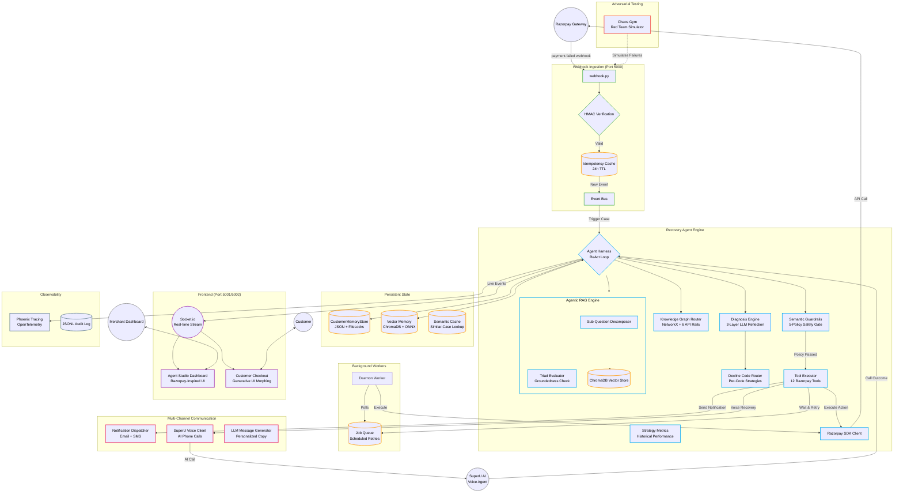

# AutoRecover — Razorpay AI Revenue Recovery Agent

An autonomous AI agent that detects failed payments, diagnoses root causes via LLM diagnostic reflection, and executes multi-channel recovery workflows — email, SMS, and **AI voice calls via SuperU** — using official Razorpay APIs. Built for the Razorpay Buildathon with LangGraph, Nemotron LLM, NVIDIA NAT Guardrails, and a Razorpay Agent Studio-inspired Merchant Dashboard.

---

## 🎯 How It Works

```
Payment Fails → Webhook Sensing → LLM Diagnostic Reflection → Tier Assignment → Decline-Code Routing
  → Guardrail Check → Knowledge Graph Routing → Channel Selection (Email / SMS / SuperU Voice Call)
  → Razorpay SDK Tool Execution → Outcome Observation → Generative UI Morphing
```

### System Architecture



### Three-Tier Recovery (Industry-Grade)

```
Payment fails
  ├─ TIER 1: SILENT RECOVERY (Background — no customer contact)
  │   ├─ Analyze decline code + 40+ signals
  │   ├─ Schedule retry at optimal window (payday timing, bank health)
  │   ├─ Customer stays active, unaware of failure
  │   └─ Multiple silent retries before escalation
  │
  ├─ TIER 2: ACTIVE RECOVERY (Customer-facing — if Tier 1 exhausted)
  │   ├─ Personalized email/SMS via LLM-generated messaging
  │   ├─ Razorpay Payment Links for one-click recovery
  │   └─ Copy adapts to specific decline reason + customer persona
  │
  └─ TIER 3: VOICE RECOVERY (AI Phone Call — high-value or unresponsive)
      ├─ SuperU AI voice agent calls the customer directly
      ├─ Natural conversation: identifies objection, offers alternatives
      ├─ Sends Razorpay Payment Link during the call
      └─ Customer can complete payment while on the phone
```

> **Why Voice?** Industry data shows email-only recovery converts 3-8%, email+SMS converts 8-15%, but adding AI voice calls pushes recovery to **25-40%**. This is the same stack Razorpay uses in production with SuperU.

### Stopping Conditions
- **Recovered** — Payment retried, payment link completed, or card expiry updated via Razorpay API.
- **Escalated** — Handed off to human support when attempts or risk thresholds are reached.
- **Max Attempts** — Agent stops after bounded attempts (separate limits for silent and active tiers).
- **Abandoned** — Stopped when customer opts out or no viable recovery path exists.

---

## 🔬 Official Razorpay Knowledge Base & Failure Normalizer

The system embeds an official Razorpay API Error Knowledge Base (`src/recovery_agent/razorpay_knowledge_base.py`) built directly from Razorpay's official API Error documentation:

- **Error Codes Catalog**: `BAD_REQUEST_PAYMENT_TEMPORARY_TECHNICAL_ISSUE`, `BAD_REQUEST_CARD_EXPIRED`, `BAD_REQUEST_PAYMENT_INSUFFICIENT_FUNDS`, `BAD_REQUEST_PAYMENT_DECLINED_BY_BANK`, `BAD_REQUEST_MANDATE_INACTIVE`, `BAD_REQUEST_CHECKOUT_ABANDONED`, `BAD_REQUEST_RISK_CHECK_FAILED`.
- **Error Taxonomy**:
  - `source`: `customer`, `business`, `gateway`, `razorpay`.
  - `step`: `payment_initiation`, `payment_authentication`, `payment_authorization`, `payment_capture`.
- **Payload Normalization**: Automatically normalizes customer-facing UI messages (e.g. *"Your payment could not be completed due to a temporary technical issue. To complete the payment, use another payment instrument."*) into full Razorpay API Failure Payloads.

---

## 🖥️ Razorpay Agent Studio-Inspired Dashboard

The Merchant Dashboard ([http://localhost:5002/merchant](http://localhost:5002/merchant)) is modeled directly after [Razorpay's Agent Studio](https://razorpay.com/agent-studio/):

- **Dark Top Navigation Bar**: Razorpay-style navbar with product links (Ray AI, Payments, Banking+, Payroll), search, and avatar.
- **Left Sidebar**: Full sidebar with sections — Main, Payment Products, Banking Products, Account & Settings. Agent Studio highlighted with `Beta` badge.
- **Agent Hero Card**: Agent identity (avatar + name), health indicator with pulsing green dot, Disable/Open Store action buttons.
- **Activity/Settings Tabs**: Clean tab bar with underline-style active indicator.
- **Scenario Triggers**: One-click buttons to simulate failures — 504 Degradation, Cart Abandonment, Expired Card, Bank Decline, Voice Call, and a 30-case batch runner.
- **Inline Metrics Bar**: 4 key metrics — Total, Recovered, Failed, Recovery Rate.
- **Activity Feed**: Real-time timeline with colored status dots (blue = processing, green = recovered, red = failed), relative timestamps, and "Live" indicators for active recoveries.
- **Case Detail Drawer**: Slide-out panel with payment info, status/tier badges, decline strategy, and full agent reasoning trail with color-coded step borders.

---

## 🛠️ Setup & Usage

### Prerequisites
- Python 3.12+
- Razorpay test account ([Razorpay API Keys](https://dashboard.razorpay.com/app/keys))

### Install & Configure

```bash
git clone https://github.com/suraj-0628/Razorpay-AI-Revenue-Recovery-Agent.git
cd Razorpay-AI-Revenue-Recovery-Agent
python -m venv .venv
source .venv/bin/activate
pip install -e .
cp .env.example .env
```

### Start Services

```bash
./start.sh
```

Serves:
- **Merchant Operations HUD**: [http://localhost:5002/merchant](http://localhost:5002/merchant)
- **Customer Store Checkout**: [http://localhost:5002/pay](http://localhost:5002/pay)
- **Recovery Analytics Dashboard**: [http://localhost:5001](http://localhost:5001)
- **LangGraph Agent Flow Graph**: [http://localhost:5001/graph](http://localhost:5001/graph)
- **Razorpay Webhook Listener**: [http://localhost:5000/webhook](http://localhost:5000/webhook)

---

## 🧪 Verification & Test Suite

```bash
.venv/bin/pytest tests/ -v
```

- **Unit Test Suite**: `209 PASSED` (100% pass rate).
- **Adversarial Chaos Gym**: `31 PASSED` in `10.50s`.

---

## 📁 Architecture Breakdown

```
src/recovery_agent/
├── agent/
│   ├── __init__.py              # LangGraph agent graph (detect → diagnose → decide → act → observe)
│   ├── harness.py               # Agent harness — ReAct loop orchestrator (899 lines)
│   ├── diagnosis.py             # LLM diagnostic reflection chain (3-layer)
│   ├── decision.py              # LLM Strategy Planner & Guardrail intercept
│   ├── execution.py             # Multi-channel action execution (email, SMS, voice, retry)
│   ├── guardrails.py            # Semantic guardrails — 5-policy safety gate
│   ├── kg_router.py             # Knowledge Graph router — NetworkX + 6 Razorpay API rails
│   ├── decline_router.py        # Decline-code-specific routing (per-code strategies)
│   ├── strategy_metrics.py      # Historical strategy performance tracking
│   ├── memory.py                # Customer long-term memory store & payday radar
│   ├── vector_memory.py         # Vector memory — ChromaDB episodic storage
│   ├── semantic_cache.py        # Semantic cache — similar-case deduplication
│   ├── agentic_rag.py           # Agentic RAG — sub-question decomposition + triad eval
│   ├── tools.py                 # 12 Razorpay SDK tools (Payment Links, Retry, Refund, etc.)
│   ├── llm_client.py            # Shared LLM client (Nemotron via OmniRoute)
│   ├── squad.py                 # Multi-agent squad orchestrator (4 specialized agents)
│   ├── signals.py               # 40+ signal enrichment (BIN, timezone, velocity, payday)
│   ├── payday_scheduler.py      # Regional payroll cycle detection & optimal retry timing
│   ├── stopping.py              # Stopping condition evaluator
│   ├── evaluation.py            # Recovery trajectory evaluation & scoring
│   └── test_generator.py        # Synthetic test case generator
├── eval/
│   ├── chaos_gym.py             # Adversarial chaos gym & red-team simulator
│   └── trajectory_benchmark.py  # Step/friction/compliance scoring
├── razorpay_knowledge_base.py   # Official Razorpay API Error Catalog & Normalizer
├── razorpay_client.py           # Razorpay SDK API wrapper (Orders, Payments, Links, Refunds)
├── frontend.py                  # Agent Studio Dashboard & Customer Checkout (Razorpay-inspired)
├── webhook.py                   # Razorpay Webhook Listener + SuperU call-complete callback
├── dashboard.py                 # Recovery Analytics Dashboard (Port 5001)
├── communication.py             # LLM-generated personalized recovery messages
├── notifications.py             # Multi-channel notification dispatcher (Email + SMS)
├── retry_scheduler.py           # Smart retry timing with bank health awareness
├── state_store.py               # Persistent case state (JSON + file locks)
├── daemon_worker.py             # Background worker for scheduled retries
├── main.py                      # Service entry point & process orchestrator
├── logging/                     # JSONL structured audit logging
└── templates/
    └── index.html               # Analytics dashboard template
```

---

## 🏭 Industry-Grade Architecture

Based on deep-dive research on 6 production recovery systems — **Stripe, Redux, Recurly, Churnkey, Slicker, and Razorpay Agent Studio**.

### Implemented: Three-Tier Recovery + Decline-Code Routing

**Three-Tier Recovery Architecture** (inspired by Redux "Silent First" + Razorpay Agent Studio voice channels):
- **Tier 1 (Silent)**: Background retries with NO customer contact. Customer stays active, unaware of failure.
- **Tier 2 (Active)**: Personalized email/SMS with Razorpay Payment Links. Only triggered when silent tier exhausted.
- **Tier 3 (Voice)**: SuperU AI voice agent calls the customer. Highest-conversion channel for high-value or unresponsive cases.

**Decline-Code-Specific Routing** (`decline_router.py`):
- Code 51 (Insufficient Funds): Payday timing — retry at 12:01 AM local time on payday, "first-in-line advantage".
- Code 05 (Do Not Honor): Metadata enrichment — optimize transaction shape, cooling-off period.
- Code 19 (Try Again Later): Bank health monitoring — retry only when bank confirmed online.
- Hard Declines (41, 43, 54, 14, 04, 46, 57, 93): Never retry — prevents $0.10/attempt Visa/MC network penalties.

### Implemented: 40+ Signal Enrichment (`signals.py`)

- Card brand, type, issuing bank, BIN lookup
- Customer timezone, bank health score, velocity patterns
- Merchant descriptor, MCC code, transaction amount vs norms
- Payday detection, holiday awareness, regional payroll cycles

### SuperU AI Voice Integration

| Component | Role |
|-----------|------|
| `SuperUClient` | Wraps SuperU API — initiates outbound AI voice calls |
| `execution.py` | Routes `VOICE_CALL` action type to SuperU client |
| `decision.py` | Strategy planner selects voice when: amount > ₹1000, user dropoff, or first notification unresponsive |
| `webhook.py` | Receives `/superu/call-complete` callback with call outcome |
| Dashboard | Shows voice call status in activity feed + drawer trail |

### Recovery Rate Targets

| Channel Mix | Target | Industry Benchmark |
|-------------|--------|-------------------|
| Email only | 3-8% | — |
| Email + SMS | 8-15% | Redux 40-50% (with silent retry) |
| Email + SMS + Silent Retry | 40-55% | Stripe 55%, Recurly 70% |
| **+ SuperU Voice Calls** | **55-75%** | Razorpay Agent Studio production |

---

## 🤝 Technology Partners

| Partner | Role | Integration |
|---------|------|-------------|
| **Razorpay** | Payment gateway + SDK + Webhooks | Core — all payment operations |
| **SuperU AI** | AI voice calling platform | Tier 3 voice recovery — outbound AI phone calls |
| **NVIDIA** | Nemotron LLM + NIM Guardrails | Agent reasoning + safety policies |
| **LangGraph** | Agent orchestration framework | ReAct loop + state machine |
| **ChromaDB** | Vector database | Agentic RAG + episodic memory |
| **Phoenix** | Observability + tracing | OpenTelemetry spans for every agent decision |

---

## 📄 License

Razorpay Buildathon 2026 — AI Revenue Recovery Track
