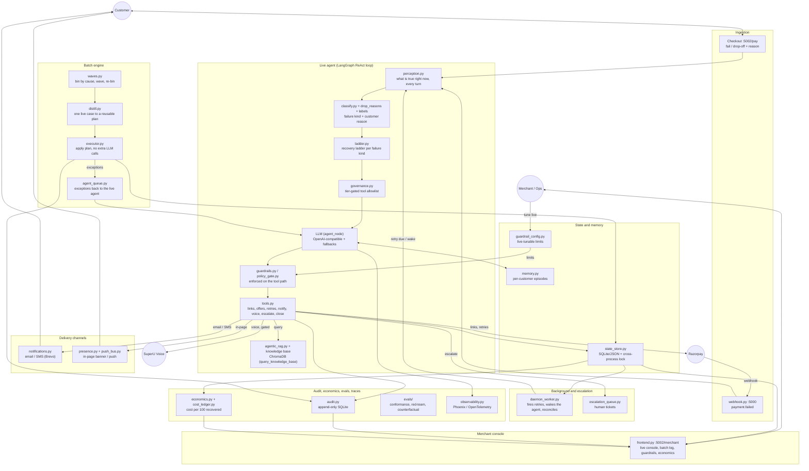

# AutoRecover

An autonomous agent that recovers failed online payments.

[](https://github.com/suraj-0628/AutoRecover-Revenue-Recovery-Agent/actions/workflows/ci.yml)
[](https://www.python.org/downloads/)

When a payment fails, AutoRecover works out why it failed and runs a recovery
plan that fits the cause: a different payment rail for a bank decline, a timed
retry for an underfunded account, a discount only when price is the real
objection. It stops when the money is collected or when a human is genuinely
needed. The same agent handles a single live payment in real time and a backlog
of thousands in batches.

Built for the Razorpay AI Buildathon, Track 03 (AI Revenue Recovery).

## Contents

- [Demo](#demo)
- [Highlights](#highlights)
- [How it works](#how-it-works)
- [Architecture](#architecture)
- [Getting started](#getting-started)
- [Configuration](#configuration)
- [Usage](#usage)
- [Key components](#key-components)
- [Project structure](#project-structure)
- [Testing and evaluation](#testing-and-evaluation)
- [Tech stack](#tech-stack)

## Demo

Video walkthrough: https://youtu.be/qD1PRjWxaqY

Once the stack is running (see [Getting started](#getting-started)):

| Surface | URL | Purpose |
|---------|-----|---------|
| Customer checkout | `http://localhost:5002/pay` | Make and fail a payment |
| Merchant console | `http://localhost:5002/merchant` | Watch the agent work the case live, with recovery metrics and unit economics |
| Phoenix tracing | `http://localhost:6006` | One trace session per case |

## Highlights

- **Cause-aware recovery.** Each failure type follows its own ordered policy
  (the recovery ladder). The agent cannot jump straight to a discount or an
  escalation; it has to climb the ladder for that cause first.
- **Real time and batch from one agent.** The live agent handles a single
  payment as it fails. The batch engine reuses that same reasoning across a
  backlog by distilling one worked case into a plan and replaying it over
  look-alike cases with no extra model calls.
- **Guardrails enforced in code.** Contact limits, discount ceilings, quiet
  hours, and opt-out are checked between the agent and its tools, so a blocked
  action is blocked rather than merely discouraged. Every limit is tunable at
  runtime from the merchant console.
- **Multi-channel outreach.** In-page prompts, email and SMS, and optional AI
  voice calls, each with its own eligibility rules.
- **Append-only audit log.** A SQLite table that rejects `UPDATE` and `DELETE`,
  so the recovery record cannot be rewritten after the fact.
- **Unit economics.** Cost per 100 rupees recovered, computed from real token,
  message, and call costs rather than estimates.
- **Evaluation suite.** Conformance, red-team, and counterfactual checks with a
  frozen baseline and a CI gate that fails on regression.
- **Full tracing.** Every case is one Arize Phoenix session, with typed spans
  for model calls, tools, and guardrails.

## How it works

A single recovery, from failure to close:

1. **A payment fails.** Either Razorpay sends a `payment.failed` webhook, or the
   customer fails or abandons the hosted checkout.
2. **If the customer is still on the page**, the agent asks one question about
   why they stopped. Their own answer is more reliable than a guess from an
   error code.
3. **The agent classifies the failure** and picks the plan for that cause. A
   bank decline needs a different rail at full price. An underfunded account
   needs a timed retry. A price objection is the one case a discount answers.
4. **The agent acts.** It creates a payment link on a working rail, shows it in
   the page or sends it by email, or schedules a quiet retry. Then it waits
   without repeatedly contacting the customer.
5. **When the gateway confirms the money has arrived**, the agent closes the
   case. If it runs out of viable options, it escalates to a human, and only
   then.

The batch engine applies the same logic to a backlog (see
[Key components](#key-components)).

## Architecture

The design principle is that the intelligence lives in the structure around the
model, not in a larger prompt. The model decides what to do. The surrounding
code decides what it is allowed to do, keeps track of what is currently true,
and guarantees that every case reaches a clean ending.



**Ingestion.** `webhook.py` handles the Razorpay `payment.failed` event. The
checkout page posts failures and drop-offs, along with the customer's stated
reason, to the frontend.

**Live agent.** A LangGraph ReAct loop in `agent/graph.py`. On each turn,
`perception` rebuilds the ground truth from the durable record, `classify`
decides the failure kind, `ladder` returns the steps allowed for that kind,
`governance` binds only the permitted tools, the model chooses an action, and
every tool call passes through the guardrail gate before it runs.

**Batch engine.** The same agent at scale, under `batch/`. Cases are binned by
cause. The live agent works one representative case per bin, its decision is
distilled into a plan, and the plan is replayed across the look-alike cases with
no additional model calls. Anything that does not fit the plan is handed back to
the live agent.

**State and memory.** `state_store.py` is the durable, cross-process case store.
`memory.py` keeps per-customer recovery history. `presence.py` and `push_bus.py`
deliver in-page notifications only when the customer is actually on the page.

**Trust surfaces.** An append-only audit log, unit economics, an evaluation
suite, and full tracing. These are described under
[Key components](#key-components).

## Getting started

### Prerequisites

- An OpenAI-compatible LLM endpoint (URL, model name, API key). Any provider
  works: OpenAI, Gemini, Groq, Together, or a local router.
- Razorpay test-mode API keys.
- Either Docker, or Python 3.11 or newer (3.12 recommended).

### Option A: Docker

No local Python setup required.

```bash
cp .env.example .env        # add your Razorpay test keys and LLM endpoint
docker compose up --build
```

The image runs all services in one container and maps ports 5000, 5002, and
6006, so the URLs in the [Demo](#demo) section work unchanged. State lives inside
the container and is recreated on each start.

If your LLM runs on the host machine, set `LLM_BASE_URL` to
`http://host.docker.internal:PORT/v1` in `.env`. Inside a container, `localhost`
refers to the container itself.

### Option B: Local

```bash
make setup                  # create .venv and install the package
cp .env.example .env        # add your Razorpay test keys and LLM endpoint
make start                  # start all services and print their health
```

`make start` (which runs `./start.sh`) launches four processes:

| Process | Port | Role |
|---------|------|------|
| Frontend | 5002 | Customer checkout and merchant console |
| Webhook | 5000 | Razorpay `payment.failed` listener |
| Phoenix | 6006 | Tracing |
| Daemon | (background) | Scheduled retries, batch settle, cost reconciliation |

Stop everything with `make stop`.

## Configuration

Configuration is read entirely from environment variables. Copy `.env.example`
to `.env` and fill in the required values.

### Required

| Variable | Description |
|----------|-------------|
| `RAZORPAY_KEY_ID`, `RAZORPAY_KEY_SECRET` | Razorpay test-mode API keys |
| `LLM_BASE_URL` | OpenAI-compatible endpoint, for example `https://api.openai.com/v1` |
| `LLM_MODEL` | Model name, for example `gpt-4o`. A capable reasoning model is recommended |
| `LLM_API_KEY` | API key for that endpoint |

### Optional

| Variable | Default | Description |
|----------|---------|-------------|
| `LLM_FALLBACK_MODELS` | (none) | Comma-separated models tried in order if the primary is unavailable |
| `LLM_TIMEOUT` | `90` | Per-call time budget in seconds |
| `VOICE_CALLS_ENABLED` | `0` | Enable SuperU voice calls |
| `SUPERU_API_KEY`, `SUPERU_ASSISTANT_ID`, `SUPERU_FROM_PHONE` | (none) | Voice provider credentials |
| `BREVO_API_KEY` or `SMTP_HOST` / `SMTP_PORT` / `SMTP_USER` / `SMTP_PASS` / `SMTP_FROM` | (none) | Email delivery. Without these, messages are written to `data/outbox/` |
| `FRONTEND_PORT`, `WEBHOOK_PORT` | `5002`, `5000` | Override default ports |
| `RAZORPAY_LINKS_ALREADY_SPENT` | `0` | Count of payment links already used against the account's lifetime quota |

Only the Razorpay keys and an LLM endpoint are needed to run. SuperU voice,
email, and Phoenix tracing are all optional and off by default. The stack boots
and demos without them.

## Usage

### Recover a live payment

1. Open the checkout at `http://localhost:5002/pay`.
2. Fail a payment, or start one and abandon it.
3. Open the merchant console at `http://localhost:5002/merchant` and watch the
   agent diagnose the failure, choose a recovery step, and drive the case to a
   close.

### Work a backlog in batches

The merchant console groups the at-risk backlog into batches that share a cause.
For each batch you can preview the plan (what the agent would do, and to whom,
without doing any of it) and then run it. The live agent works one case per
batch, and its plan is applied across the rest.

### Tune guardrails at runtime

The guardrail panel in the merchant console exposes contact caps, the discount
ceiling, quiet hours, and the voice toggle. Changes take effect on the agent's
next decision. Opt-out cannot be disabled, because it is a legal requirement
rather than a setting.

## Key components

### Recovery ladder

`agent/ladder.py`. There is no single recovery script. Each failure kind climbs
its own ordered set of steps, and the agent cannot skip ahead.

| Failure kind | Ladder, in order |
|--------------|------------------|
| method (bank or instrument decline) | page push, rail switch at full price, offer, voice call, alternate path |
| funds (underfunded account) | timed retry, page push, offer, alternate path |
| transient (gateway or network) | timed retry, page push, alternate path. No discount, since the failure was not the customer's fault |
| dropoff (chose not to pay) | page push, offer, voice call, post-call email, alternate path |

`escalate_to_human` and `close_case(unrecoverable)` are refused until the ladder
for that cause is genuinely exhausted. Compliant escalation is enforced in code.

### Customer reason over inferred cause

`drop_reasons.py`. Two customers who abandon after a decline look identical to an
error code but need opposite responses. The checkout asks one question
(transaction kept failing, found it cheaper, or did not have the money), and
that answer re-routes the ladder.

### Guardrails

`guardrails.py`, `policy_gate.py`, `guardrail_config.py`. The guardrail engine
sits between the agent and its tools and returns a hard block with a reason,
rather than advice the model can talk itself out of. Every limit is a live
control in the merchant console and takes effect on the next decision.

### Multi-channel outreach

- In-page: `show_page_offer` and `send_page_push`, delivered only to a live
  checkout session.
- Email and SMS: `notifications.py`, email over Brevo SMTP, metered against a
  daily budget (`email_quota.py`).
- Voice: `initiate_voice_call` places a real call through SuperU, only above an
  order-value threshold, never during quiet hours, and only after cheaper steps
  have had their chance. Call cost is reconciled against SuperU's own bill
  (`cost_ledger.py`) rather than estimated.

### Append-only audit trail

`audit.py` is a SQLite table whose `UPDATE` and `DELETE` are refused by triggers.
The batch log in the merchant console is a direct read of it, so every line on
screen is a row that cannot be quietly rewritten.

### Unit economics

`economics.py` accumulates real token, message, and call costs per case and
reports cost per 100 rupees recovered. Live cases are kept separate from seeded
test cases so the figure stays honest.

### Evaluation

`evals/`. Every decision is logged and scored against policy (conformance). A
red-team suite tries to trick the agent into an unwarranted discount or a
premature escalation. A counterfactual compares the agent's discount discipline
against a naive "discount everyone" baseline. Scores are frozen as a baseline so
a regression fails before it ships.

```bash
make evals    # run the suite, write EVALS.md and a scorecard
make ci       # tests plus a recorded-decision regression gate
```

### Observability

`observability.py` sets up one shared Arize Phoenix and OpenTelemetry
initialization. Every span carries `session.id = case:{payment_id}`, so a
Phoenix session corresponds to a single recovery case. Spans are typed (AGENT,
CHAIN, LLM, TOOL, GUARDRAIL), and each records running token and rupee cost.

## Project structure

```
src/recovery_agent/
├── agent/                 # the live agent
│   ├── graph.py           #   LangGraph ReAct loop and model routing
│   ├── perception.py      #   rebuilds current ground truth each turn
│   ├── classify.py        #   failure kind and customer reason
│   ├── ladder.py          #   recovery ladder per failure kind
│   ├── governance.py      #   tier-gated tool allowlist
│   ├── tools.py           #   recovery tools (links, offers, retries, voice, close)
│   ├── guardrails.py      #   the guardrail engine
│   ├── policy_gate.py     #   guardrails enforced on the tool path
│   ├── llm_client.py      #   LLM access and capability-ordered fallback
│   ├── agentic_rag.py     #   RAG over the recovery knowledge base
│   ├── memory.py          #   per-customer recovery history
│   └── offers.py, diagnosis.py, decision_log.py, stopping.py
├── batch/                 # the same agent, at scale
│   ├── waves.py           #   bin, wave, re-bin
│   ├── distill.py         #   one live case to a reusable plan
│   ├── executor.py        #   apply the plan with no extra LLM calls
│   ├── agent_queue.py     #   exceptions back to the live agent
│   └── planner.py, plan.py, tiers.py, run.py
├── integrations/          # Brevo (email), SuperU (voice) clients
├── evals/                 # conformance, redteam, counterfactual, replay, quality
├── scripts/               # model download, cost reconciliation, backfills
├── frontend.py            # Flask and Socket.IO: checkout and merchant console (5002)
├── webhook.py             # payment.failed listener (5000)
├── daemon_worker.py       # scheduled retries, park-on-boot, reconciliation
├── state_store.py         # durable, cross-process case store
├── audit.py               # append-only audit log
├── economics.py           # unit economics
├── cost_ledger.py         # cost provenance: billed, measured, estimated
├── guardrail_config.py    # live-tunable guardrail policy
├── drop_reasons.py        # the "why did you stop" flow
├── notifications.py       # email and SMS dispatch
├── observability.py       # Phoenix and OpenTelemetry tracing
└── presence.py, push_bus.py, escalation_queue.py, email_quota.py,
    labels.py, ratelimit.py, razorpay_client.py, razorpay_knowledge_base.py
```

## Testing and evaluation

```bash
make test     # full unit suite (1000+ tests)
make ci       # unit tests plus the recorded-decision regression gate
make evals    # the evaluation suite, writes EVALS.md and a scorecard
```

The CI workflow in `.github/workflows/ci.yml` runs the unit suite and the
recorded-decision conformance gate on every push and pull request. The gate
scores the committed corpus against a frozen baseline with no LLM and no payment
calls, so it runs for free and gets stricter as the corpus grows.

## Tech stack

| Area | Technology |
|------|------------|
| Agent | LangGraph ReAct loop, OpenAI-compatible LLM, langmem for durable memory |
| Retrieval | ChromaDB with a local ONNX embedding model |
| Payments | Razorpay Python SDK (test mode) |
| Channels | Brevo SMTP (email), SuperU (AI voice) |
| Web | Flask and Socket.IO |
| State | SQLite and JSON with cross-process file locks |
| Observability | Arize Phoenix over OpenTelemetry (OpenInference) |

## Notes and limits

- Razorpay runs in test mode. Payment links draw from a small per-account
  lifetime quota, which the code tracks and protects through
  `RAZORPAY_LINKS_ALREADY_SPENT`.
- Voice calls cost real credits and are off by default. Enable them from the
  guardrail panel for a demo.
- Email needs a Brevo API key or SMTP credentials with a verified sender.
  Without one, messages are written to `data/outbox/` so the flow still runs.
- The agent never contacts a customer who has opted out, and never charges a
  payment that has already succeeded.
